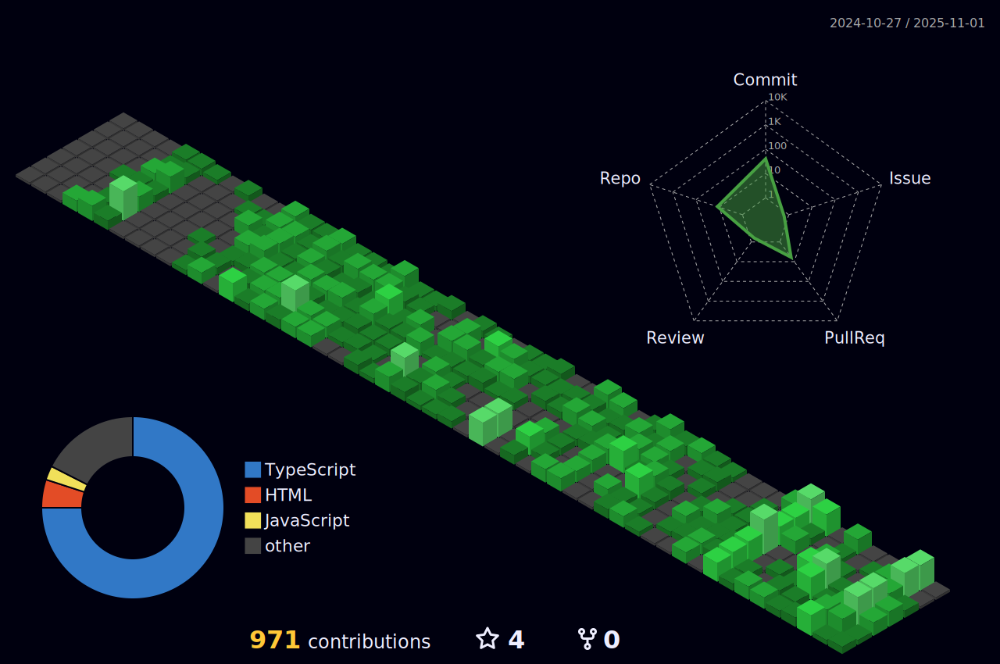

 

  

 

  

 

  
  

  

 

  <h2>🚀 Tech Stack & Tools</h2>
  

 

  <h2>🌌 3D Contribution Graph</h2>
  

 

  <h2>📈 GitHub Activity</h2>
  

 

  <h2>🔗 Let's Connect</h2>
  
  
  
  

  

 

  

